 

  

## About Me

- Tech leader focused on **solution architecture**, **backend development** and **full-stack delivery**
- Passionate about **system integration**, **automation** and **scalable web and mobile applications**
- Currently leading solution implementation and driving innovation at **MISL**

<b>Click to see what I focus on</b>

 

| Focus | What it means |
|---|---|
| Solution architecture | Turning business needs into clean, scalable system designs |
| Backend and full-stack | APIs, databases and front-ends delivered end to end |
| Integration and automation | Connecting systems and removing manual work |
| Web and mobile | Flutter, React and Android applications |

## Tech Stack

## GitHub Stats

## Contribution Snake

<picture>
  <source media="(prefers-color-scheme: dark)" srcset="https://raw.githubusercontent.com/nipunanr/nipunanr/output/github-snake-dark.svg"/>
  <source media="(prefers-color-scheme: light)" srcset="https://raw.githubusercontent.com/nipunanr/nipunanr/output/github-snake.svg"/>
  
</picture>

## Trophies

 Built with love, coffee and a lot of commits.

